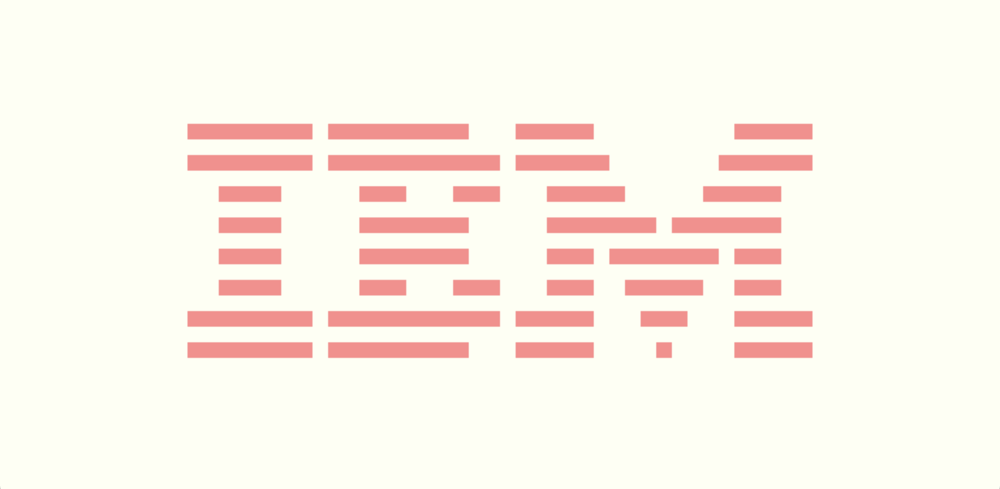
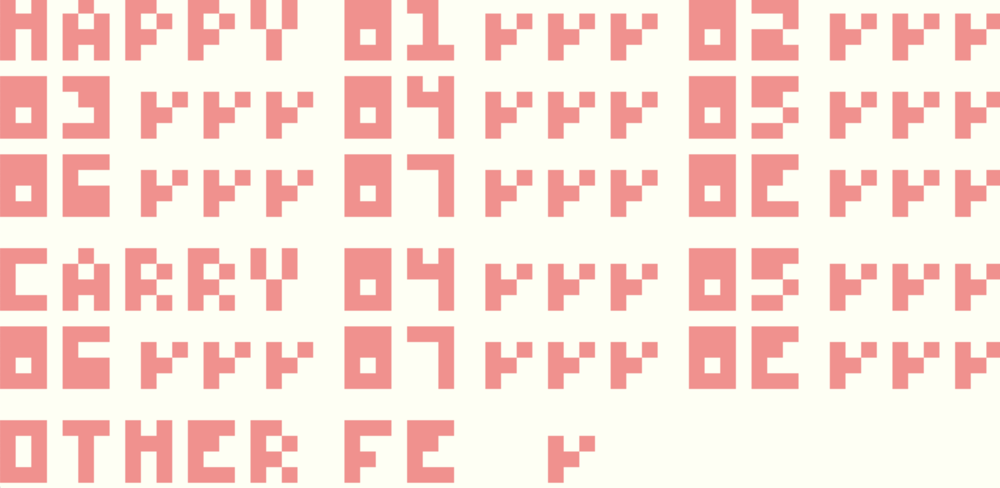

# CHIP-8 Emulator

|  |  |  |
| :---------------------------------------------------------------------------------------: | :---------------------------------------------------------------------------------------: | :---------------------------------------------------------------------------------------: |
|                                          IBM ROM                                          |                                      Space Invaders                                       |                                   Timendus' OpCode Test                                   |

An emulator for the simplest chip out there, CHIP-8.

I read a bit of C++ and wanted to make something using all the new goodness that I had learned, and that is how this got made.

## How to Install?

### Pre-built Binaries

Prebuilt binaries for the following platforms are included in the `build` directory.

- macOS Apple M1
- Linux amd64

If there is no binary file for your platform then you would have to yourself [build from source](#bulding-from-source). However if your platform is listed then do the following:

- Download the appropriate file for your system from the [`build`](./build/) directory
  - For example if you are on an M1 Mac then download the `macos_m1.o` file from the above link
- Open a terminal in the folder in which you downloaded the file
  - If you download the file in your "Downloads" folder then open up a terminal and run `cd Downloads` for this step
- Run `./<downloaded-file-name>.o` to start the emulator
  - Again, for example. if you downloaded the `macos_m1.o` file then run `./macos_m1.o`

These binaries have the space Invaders rom loading using the default settings. If you want to customize the emulator's screen size, or colors then you would need to build from source (see [customization](#customizations) below).

### Bulding from Source

> ⚠️ I have verified the build process on macOS, and Linux. Unfortunately I have not had the time to test on Windows, so if anyone gets this running on Windows feel free to let me know. Moreover I have not tested on an Intel Mac, but I believe it should work just the same.

#### Pre-requisites

Following dependencies are required for following with the steps ahead:

- [Make](https://www.gnu.org/software/make/)
- [SDL2](https://www.libsdl.org/)

#### Installing

- Clone this repository by running `git clone https://github.com/sahej-dev/chip8-emulator`
- cd into the cloned repository by running `cd chip8-emulator`
- Run `make` to compile the binary
- Run the binary `./main.o`

## Customizations

All customization can be done before building by making the changes explained below.

### Colors

Before compiling you can customize the foreground, and background by changing the `theme.h` file as shown below

```cpp
// theme.h

#include "color.h"

namespace theme
{
    emuGL::Color backgroundColor = emuGL::Color(0x000000FF); // 0xRRGGBBBAA
    emuGL::Color foregroundColor = emuGL::Color(0xFFFFFFFF);
}

```

### Changing ROMs

The emulator can be setup to load any ROM available in the `roms` directory (you can also put more in there). To do this just change the following line in the `main.cpp` file with the path of the ROM file that you want to load on the emulator.

```cpp
// main.cpp

chip8::Emulator e{SCALE_FACTOR, "<path to the rom file>.ch8"};

```

### Adjusting the Emulator's Window Size

You can change the `SCALE_FACTOR` in `main.cpp` to adjust the size of the emulator window.

```cpp
// main.cpp

const unsigned int SCALE_FACTOR = 15;

```

Larger values of scale factor will result in a bigger window. The minimmum acceptable value for `SCALE_FACTOR` is 1. Setting in 0 would probably lead to bad things happening 🙂.

## Acknowledgements

Immense thanks to the people who made the following resources:

- [Cowgod's Chip-8 Technical Reference](http://devernay.free.fr/hacks/chip8/C8TECH10.HTM)
- Tobias V. Langhoff's [amazing blog post](https://tobiasvl.github.io/blog/write-a-chip-8-emulator/)
- Timendus' [CHIP-8 test suite](https://github.com/Timendus/chip8-test-suite)
- All the CHIP-8 ROM developers

## License

Everything in this repo, except the files in the `ref_resources`, and `roms` directories, is free and open source software under the terms of MIT License. More details can be found on the [LICENSE](./LICENSE) page.

Files under `ref_resources`, and `roms` directories are governed by the LICENCE under which they were originally provided.
